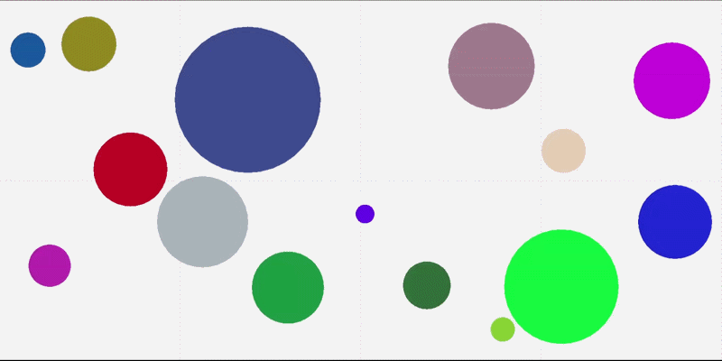

# raylib-Collision-engine

## About 
This project is the starting point of me learning how to work with raylib and the building systems.

## Features 
- Robust grid-based collision system 
- Ability to generate any possible amount of entities on the screen 
- Highly customizable to your needs 

## How to build 
Clone the repository.
```shell
git clone https://github.com/Sett-0/raylib-Collision-engine
cd raylib-Collision-engine
```
## Windows 

### Build using make 
Make sure you have `make` installed on your system and added to the `PATH`!
```shell
build.bat
```
### Build with g++ 
If you don't have `g++`, you can get it with w64devkit from https://github.com/skeeto/w64devkit.
Make sure you added w64devkit/bin directory to the `PATH`.
```shell
g++ -O3 simple_balls.cpp -o "bin/Release/I-am-ballin-it" -I include -L lib -static-libgcc -static-libstdc++ -static -l raylib -l gdi32 -l winmm
```
## Linux
WARNING: I cannot test if it builds on Linux, so it probably won't :) <br/>
AFAIK, you can download the lib and include directories from here: https://github.com/raysan5/raylib/releases 
and then you should be able to build with it. 
But if not, please refer to this guide from `@raysan5`: https://github.com/raysan5/raylib/wiki/Working-on-GNU-Linux. <br/>
Also, no wayland support, sorry.

### Build using make 
Make sure you have `make` installed on your system and added to the `PATH`! 
```bash 
./build.sh
```
### Build with g++ 
```bash
g++ -O3 simple_balls.cpp -o "./bin/Release/I-am-ballin-it" -I include -L lib -static-libgcc -static-libstdc++ -static -l raylib -l pthread -l m -l dl -l rt -l X11
```
## Gallery 
